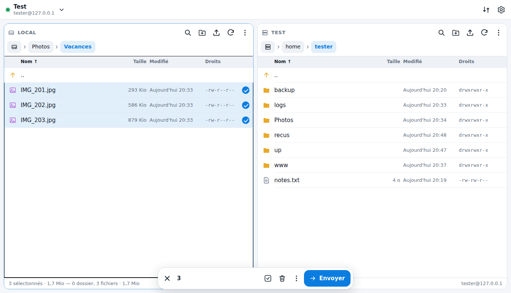
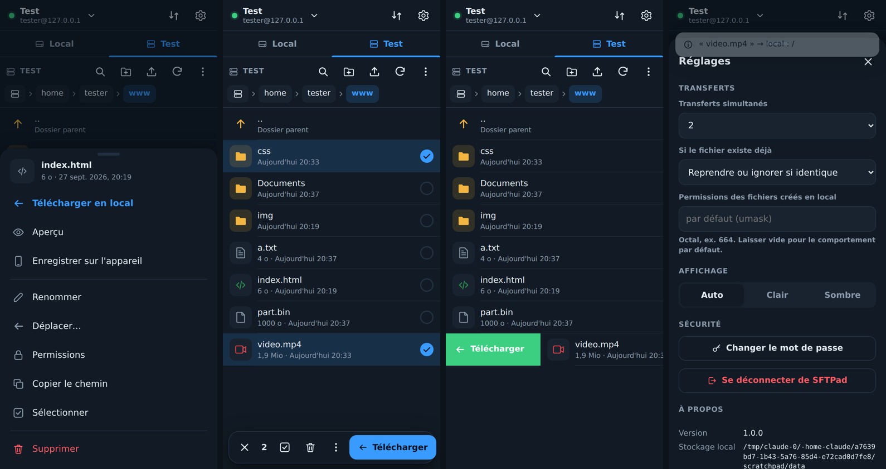

# SFTPad

Client **SFTP web, tactile et installable (PWA)**, inspiré de FileZilla, pour usage personnel. Il tourne sur un serveur
(Docker sur Unraid, LXC Proxmox ou tout hôte Docker) : le côté « local » est le **stockage monté** dans le conteneur
(NAS, disque, partages), le côté « distant » est votre serveur SFTP. Les transferts sont exécutés **par le serveur** : ils continuent
même si vous fermez l'onglet ou verrouillez le téléphone.




## Fonctionnalités

- **Double panneau** local / distant sur grand écran, **onglets** sur mobile.
- **Gestes tactiles** : toucher pour ouvrir, **appui long** pour sélectionner, **glisser à droite** pour transférer,
  **glisser à gauche** pour le menu d'actions, glisser la feuille vers le bas pour la fermer, bouton « retour » d'Android.
- **Souris et clavier** : clic, Ctrl/Maj+clic, double-clic (ouvrir / transférer), clic droit, **glisser-déposer**
  entre panneaux, dans un dossier ou depuis le bureau de l'ordinateur, raccourcis `Suppr`, `F2`, `F5`, `Entrée`,
  `Retour arrière`, `Ctrl+A`, flèches, `Tab` pour changer de panneau.
- **File de transferts persistante** (`/config/queue.json`) : dossiers récursifs, transferts simultanés réglables,
  pause, annulation, nouvel essai, **reprise des fichiers partiels**, **nouvel essai automatique** en cas de coupure
  réseau, conservation des dates de modification, anti-doublon.
- **Si le fichier existe** : reprendre ou ignorer si identique (défaut), écraser, écraser si plus récent, ignorer, renommer.
- **Gestionnaire de sites** : mot de passe ou **clé SSH** (import, collage ou **génération ed25519** avec la clé publique
  à copier), dossiers par défaut, couleur. Secrets **chiffrés AES-256-GCM** au repos.
- **Vérification de la clé d'hôte** comme FileZilla : empreinte SHA256 à approuver à la première connexion,
  alerte en cas de changement.
- **Depuis / vers l'appareil** : envoi de fichiers ou de dossiers depuis le téléphone ou l'ordinateur (vers le local
  ou directement vers le serveur), téléchargement sur l'appareil, **aperçu** des images, vidéos (avec avance rapide),
  audio, PDF et textes.
- Renommer, déplacer, supprimer (récursif), créer un dossier, **permissions (chmod)**, filtre, tri, fichiers cachés,
  thème clair / sombre / auto.
- Authentification intégrée (mot de passe haché scrypt, sessions de 30 jours, anti force brute), ou déléguée
  à votre reverse proxy (`AUTH=none`).

## Installation

### Unraid (Docker)

L'image est publiée automatiquement sur GitHub Container Registry : **`ghcr.io/yogui26/sftpad:latest`** (amd64 et arm64),
reconstruite à chaque modification de la branche `main` (workflow `.github/workflows/docker.yml`).

1. Dans le terminal d'Unraid, récupérez le modèle :
   ```bash
   wget -O /boot/config/plugins/dockerMan/templates-user/my-SFTPad.xml \
     https://raw.githubusercontent.com/Yogui26/sftpad/main/deploy/unraid/sftpad.xml
   ```
2. Onglet **Docker → Add Container**, choisissez le modèle **SFTPad**, vérifiez les chemins, puis **Apply**.

| Paramètre | Conteneur | Défaut | Rôle |
|---|---|---|---|
| Interface web | `8080` | `8080` | Port web |
| Configuration | `/config` | `/mnt/user/appdata/sftpad` | Sites, secrets chiffrés, file |
| Stockage local | `/data` | `/mnt/user` | Ce que SFTPad voit comme « local » |
| PUID / PGID | | `99` / `100` | Propriétaire des fichiers écrits (nobody:users) |
| UMASK | | `000` | Permissions des fichiers créés |

Les mises à jour apparaissent ensuite dans l'onglet Docker d'Unraid comme pour n'importe quel conteneur.

Construire l'image soi-même reste possible : `docker build -t sftpad:latest .` dans ce dossier, puis remplacer
le dépôt du modèle par `sftpad:latest`.

### Tout hôte Docker (docker compose)

```bash
docker compose up -d --build
```

Adaptez `docker-compose.yml` : le volume `/data`, `PUID`/`PGID` (le propriétaire voulu pour les fichiers téléchargés).

### Proxmox — LXC sans Docker

Sur l'hôte Proxmox, depuis ce dossier :

```bash
DATA_HOST_PATH=/tank/partage bash deploy/proxmox/create-lxc.sh
```

Le script télécharge le modèle Debian 12, crée un conteneur **non privilégié** (512 Mo, 4 Go, démarrage automatique),
monte `DATA_HOST_PATH` sur `/data`, installe Node.js 22 et SFTPad en **service systemd**, et affiche l'adresse.
Variables utiles : `CTID`, `CT_HOSTNAME`, `STORAGE`, `BRIDGE`, `IP` (`dhcp` ou `192.168.1.50/24,gw=192.168.1.1`),
`DISK`, `MEM`, `CORES`, `SFTPAD_UID`/`SFTPAD_GID`.

> **Droits en conteneur non privilégié** : l'utilisateur `sftpad` (uid 1000) du conteneur correspond à l'uid **101000**
> sur l'hôte. Pour qu'il puisse écrire dans le dossier monté : `chown -R 101000:101000 /tank/partage`, ou une ACL
> `setfacl -R -m u:101000:rwX,d:u:101000:rwX /tank/partage`.

Mise à jour : `CTID=105 bash deploy/proxmox/update-lxc.sh` depuis la nouvelle version des sources.

Dans un LXC ou une VM Debian/Ubuntu existants, lancez simplement `bash deploy/lxc/install.sh` en root depuis ce dossier
(le script est idempotent : relancez-le pour mettre à jour). Configuration : `/etc/sftpad.env`, données : `/var/lib/sftpad`.

Vous préférez Docker dans un LXC ? Créez un LXC avec `nesting=1`, installez Docker, puis suivez la section docker compose.

## Configuration (variables d'environnement)

| Variable | Défaut | Description |
|---|---|---|
| `PORT` | `8080` | Port HTTP |
| `CONFIG_DIR` | `/config` | État de l'application (à sauvegarder) |
| `DATA_DIR` | `/data` | Racine du côté « local » |
| `ADMIN_PASSWORD` | | Mot de passe imposé (sinon choisi au premier lancement) |
| `AUTH` | | `none` pour désactiver l'authentification intégrée (reverse proxy authentifiant obligatoire) |
| `TRUST_PROXY` | réseaux privés | Réglage `trust proxy` d'Express, pour les adresses IP derrière un reverse proxy |
| `PUID` / `PGID` / `UMASK` | `99` / `100` / `002` | Docker uniquement : utilisateur et masque des fichiers créés |

Réglages modifiables dans l'interface : transferts simultanés (1 à 10), comportement si le fichier existe, permissions des
fichiers créés en local, thème.

## Accès distant et HTTPS

Pour installer la PWA sur un téléphone, le navigateur exige **HTTPS** (sauf `localhost`). Placez SFTPad derrière votre reverse proxy
(Nginx Proxy Manager, SWAG, Traefik, Caddy…) avec le **WebSocket activé** (chemin `/ws`, utilisé pour la progression en direct). Exemple Caddy :

```
sftp.mondomaine.fr {
    reverse_proxy 192.168.1.20:8080
}
```

Pour de gros envois depuis l'appareil, augmentez la taille maximale du corps de requête du proxy (`client_max_body_size 0;` sur Nginx).
Évitez d'exposer SFTPad directement sur Internet : il donne accès à vos fichiers et à vos serveurs. Un VPN (WireGuard, Tailscale)
ou une authentification au niveau du proxy est recommandé.

## Dépannage

**« Écriture refusée » / `EACCES` en téléchargeant vers le local** : SFTPad écrit avec l'utilisateur `PUID:PGID`
(99:100 = `nobody:users` sur Unraid). La racine de `/mnt/user` appartient à `root` : il faut entrer dans un
**partage** avant de transférer. Si un partage refuse aussi l'écriture (créé par root), lancez
**Tools → New Permissions** sur ce partage dans Unraid, ou corrigez `PUID`/`PGID`. L'utilisateur effectif
s'affiche dans **Réglages → À propos**.

## Sauvegarde

Tout l'état est dans `/config` : `sites.json` (secrets chiffrés), `secret.key` (clé de chiffrement — **sans elle les mots de passe
enregistrés sont perdus**), `config.json`, `queue.json`, `sessions.json`.

## Différences avec FileZilla

- SFTP uniquement (pas de FTP/FTPS).
- Le « local » est le stockage du serveur où tourne SFTPad, pas l'ordinateur du navigateur ; l'appareil reste accessible
  par l'envoi et le téléchargement direct.
- Un site affiché à la fois (bascule rapide via le gestionnaire), pas d'onglets de connexion multiples.
- Les dossiers ne se téléchargent pas directement sur l'appareil (transférez-les vers le local, ou fichier par fichier).
- Pas d'édition de fichier distant en place, pas de comparaison de dossiers ni de synchronisation.
- Les liens symboliques du stockage local sont suivis (pratique pour des points de montage, mais ils peuvent pointer hors de `/data`).

## Développement

```bash
npm install
CONFIG_DIR=./config DATA_DIR=./data npm start   # http://localhost:8080
```

Aucune étape de compilation : backend Node.js (Express 5, ssh2, ws), interface en JavaScript natif (modules ES).

```
server/   index.js (API, auth, WebSocket) · sftp.js (connexions, clés d'hôte) · transfers.js (file) ·
          fastio.js (E/S SFTP en pipeline avec reprise) · localfs.js (stockage local) · crypto.js · store.js
public/   index.html · style.css · app.js · js/ (pane, queue, sites, ui, api, util) · sw.js · manifest
deploy/   docker/ · unraid/ · lxc/ · proxmox/
```

Licence GPL-3.0-or-later.
